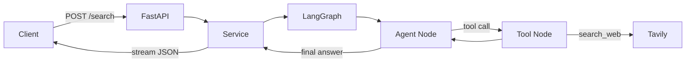

# Search Agent

A production-ready **web search agent API** built with **FastAPI**, **LangGraph**, and **LangChain**. Ask a question, the agent searches the web via Tavily, reasons over the results with an OpenAI model, and streams the answer back as JSON.

## Features

- **ReAct agent** — LangGraph loop that decides when to call tools and when to answer
- **Web search** — Tavily-powered `search_web` tool for up-to-date information
- **Streaming responses** — answers stream token-by-token in `{"answer": "..."}` JSON format
- **Typed API** — request/response validation with Pydantic
- **Secure config** — API keys loaded via `pydantic-settings` and `SecretStr`
- **Interactive docs** — auto-generated OpenAPI UI at `/docs`

## Architecture



### Request flow

1. Client sends a question to `POST /search`
2. The **agent node** (OpenAI LLM) decides whether to call `search_web`
3. The **tool node** runs Tavily and returns search results
4. The agent synthesizes a final answer
5. Tokens stream back to the client as a JSON object: `{"answer": "..."}`

## Project structure

```
search-agent/
├── main.py                  # FastAPI app entry point
├── requirements.txt
├── .env.example             # Environment variable template
├── agent/
│   ├── config.py            # Settings (pydantic-settings)
│   ├── schemas.py           # API models (pydantic)
│   ├── tools.py             # LangChain tools (search_web)
│   ├── graph.py             # LangGraph ReAct agent
│   ├── service.py           # Streaming search service
│   └── api/
│       ├── routes.py        # /health, /search endpoints
│       └── dependencies.py  # FastAPI dependency injection
```

## Prerequisites

- Python 3.11+
- [OpenAI API key](https://platform.openai.com/api-keys)
- [Tavily API key](https://tavily.com/)

## Installation

### 1. Clone the repository

```bash
git clone https://github.com/YOUR_USERNAME/search-agent.git
cd search-agent
```

### 2. Create a virtual environment

**Using uv (recommended):**

```bash
uv venv
source .venv/bin/activate   # macOS/Linux
uv pip install -r requirements.txt
```

**Using pip:**

```bash
python -m venv .venv
source .venv/bin/activate   # macOS/Linux
pip install -r requirements.txt
```

### 3. Configure environment variables

```bash
cp .env.example .env
```

Edit `.env` and add your keys:

```env
OPENAI_API_KEY=your_openai_api_key
TAVILY_API_KEY=your_tavily_api_key
LLM_MODEL=gpt-4o-mini
TAVILY_MAX_RESULTS=3
```

> **Never commit `.env`** — it is listed in `.gitignore`. Only `.env.example` should be pushed to GitHub.

## Running the server

```bash
uvicorn main:app --reload --host 0.0.0.0 --port 8000
```

The API will be available at:

| URL | Description |
|-----|-------------|
| http://localhost:8000/docs | Swagger UI (interactive docs) |
| http://localhost:8000/redoc | ReDoc API reference |
| http://localhost:8000/health | Health check |

## API reference

### `GET /health`

Check that the server is running.

**Response:**

```json
{
  "status": "ok"
}
```

---

### `POST /search`

Search the web and stream an AI-generated answer.

**Request body:**

```json
{
  "query": "Who is the current president of Nigeria?"
}
```

| Field | Type | Required | Description |
|-------|------|----------|-------------|
| `query` | string | yes | Question to answer (1–4000 characters) |

**Response:** `application/json` (streamed)

The response streams incrementally and forms a single JSON object when complete:

```json
{
  "answer": "The current President of Nigeria is Bola Ahmed Tinubu, who assumed office on May 29, 2023."
}
```

**Example with curl:**

```bash
curl -N -X POST http://localhost:8000/search \
  -H "Content-Type: application/json" \
  -d '{"query": "What is LangGraph?"}'
```

Use the `-N` flag so curl prints tokens as they arrive.

**Example with Python:**

```python
import json
import httpx

with httpx.stream(
    "POST",
    "http://localhost:8000/search",
    json={"query": "What is LangGraph?"},
) as response:
    raw = "".join(response.iter_text())
    data = json.loads(raw)
    print(data["answer"])
```

**Error response (500):**

```json
{
  "detail": "Search failed."
}
```

## Environment variables

| Variable | Required | Default | Description |
|----------|----------|---------|-------------|
| `OPENAI_API_KEY` | yes | — | OpenAI API key for the LLM |
| `TAVILY_API_KEY` | yes | — | Tavily API key for web search |
| `LLM_MODEL` | no | `gpt-4o-mini` | OpenAI model name |
| `TAVILY_MAX_RESULTS` | no | `3` | Number of search results (1–10) |

## How the agent works

### Tools (`agent/tools.py`)

The agent has access to:

| Tool | Description |
|------|-------------|
| `search_web` | Searches the web via Tavily for current information |

### Graph (`agent/graph.py`)

A LangGraph **ReAct** workflow:

```
START → agent → (tool call?) → tools → agent → ... → END
```

- **agent** — calls the LLM with tools bound; decides to search or answer
- **tools** — executes `search_web` and returns results to the agent

### Streaming (`agent/service.py`)

The service uses LangGraph's `astream` with `stream_mode="messages"` to capture LLM tokens as they are generated, then wraps them in a streaming JSON response:

```
{"answer": " + <tokens> + "}
```

## Tech stack

| Layer | Technology |
|-------|------------|
| API | FastAPI, Uvicorn |
| Validation | Pydantic, pydantic-settings |
| Agent orchestration | LangGraph |
| LLM & tools | LangChain, langchain-openai, langchain-community |
| Web search | Tavily |

## Development

### Run with auto-reload

```bash
uvicorn main:app --reload --port 8000
```

### Project dependencies

```bash
pip install -r requirements.txt
```

Or with uv:

```bash
uv pip install -r requirements.txt
```

## Security

- Store secrets in `.env` only — never in source code or git
- `.gitignore` excludes `.env`, virtual environments, caches, and credentials
- API keys are typed as `SecretStr` in settings to avoid accidental logging
- Rotate keys immediately if they are ever exposed

## License


